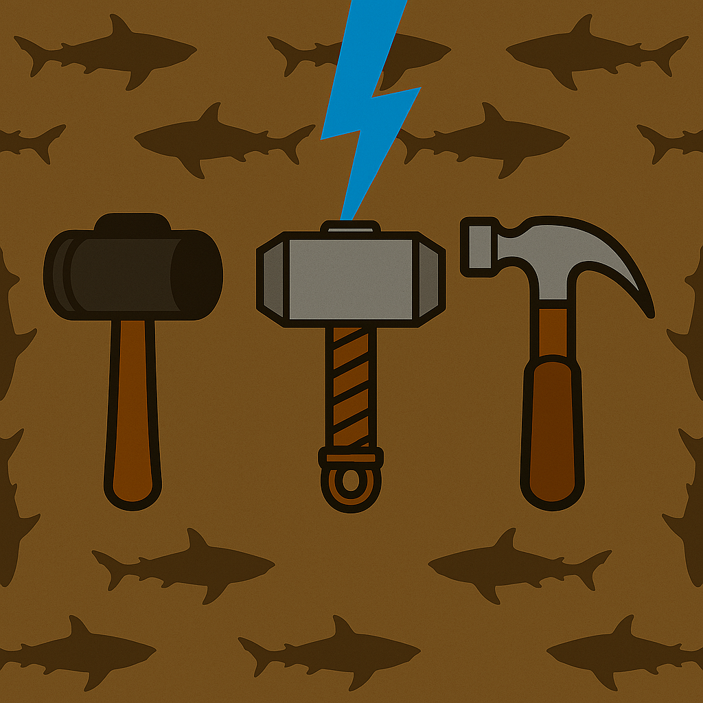

# 🦈/🤕🔨 HammerHead

Hi! I'm a developer passionate about **web apps** and **game websites** using APIs and backend servers.

---

## 🧠 Languages I Know

| Proficient / Know | Learning / Working On | Need Help With |
| ----------------- | --------------------- | -------------- |
| Python            | C++                   | TypeScript     |
| HTML              |                       | Rust           |
| Svelte            |                       | PHP            |
| Markdown          |                       | Swift          |
| JavaScript        |                       | C#             |
| CSS               |                       | R              |
|                   |                       | Ruby           |
|                   |                       | Vue            |
|                   |                       | SQL            |

Want to help me learn? Email me: [hammerhead.contact2025@gmail.com](mailto:hammerhead.contact2025@gmail.com)

---

## 💎 Favorite Language

[**SvelteKit**](https://svelte.dev) — A JS framework for dynamic pages, reusable components, layouts, and backend servers. Makes coding fast and scalable.

---

## 🔧 Currently Building

| Project          | Description                                                          | Stack                                                             | Live Link                                                                 | Repo Link                                                                 |
| ---------------- | -------------------------------------------------------------------- | ----------------------------------------------------------------- | ------------------------------------------------------------------------- | ------------------------------------------------------------------------ |
| **SNKRFinder**   | Sneaker finder pulling data from GOAT, FlightClub, and StockX.       | SvelteKit, [sneaks-api](https://www.npmjs.com/package/sneaks-api) | [snkrfinder.net](https://snkrfinder.net)                                  | [GitHub](https://github.com/Jalvie/snkrfinder)                           |
| **TVDb**         | Database of movies, TV shows, and people in the film industry.       | SvelteKit, [TMDb API](https://themoviedb.org)                     | [tvdb.vercel.app](https://tvdb.vercel.app)                                | [GitHub](https://github.com/alvieg/tvdb)                                 |
| **BiteFinder**   | Recipe finder with options from pescatarian to chemo-friendly meals. | SvelteKit, [Spoonacular API](https://spoonacular.com), Supabase   | [bite-finder.vercel.app](https://bite-finder.vercel.app)                  | [GitHub](https://github.com/alvieg/bitefinder)                           |
| **Stock Viewer** | Stock data dashboard with watchlists.                                | Python, Flask, Supabase, [Finnhub API](https://finnhub.io)        | [stock-viewer-jtax.onrender.com](https://stock-viewer-jtax.onrender.com) | [GitHub](https://github.com/alvieg/stock-viewer)                          |

---

## 🤓 Developers Who Help Me

Big thanks to [Developers Fun](https://github.com/developers-fun) 🛐 — more like partners now: I do frontend, they handle backend and hosting.

---

## 😠 Things That Annoy Me

- NPM (PNPM is better 😎)
- Git frustrations
- Errors
- CSS, JS & HTML all in one file
- Repo branch chaos
- Netlify (Vercel is better)
- Securly

---

## 🧰 My Setup

- **Code Editor:** Cursor
- **Node.js:** 24.3.0 with PNPM, NPM, and Yarn
- **Computer:** Lenovo Yoga 7 16" (AMD Ryzen 5)
- **Browser:** Opera
- **AI:** [ChatGPT](https://chatgpt.com)
- **Search Engine:** DuckDuckGo
- **Terminal:** Windows PowerShell
- **Hosting:** [Vercel](https://vercel.com) for static/basic sites, [Render](https://render.com) for advanced backends

---

## 🤙📧 Contact Me

- **Email:** [hammerhead.contact2025@gmail.com](mailto:hammerhead.contact2025@gmail.com)
- **GitHub:** [alvieg](https://github.com/alvieg)
- **Website:** TBD

---

## 🔨 Why the Hammer?
